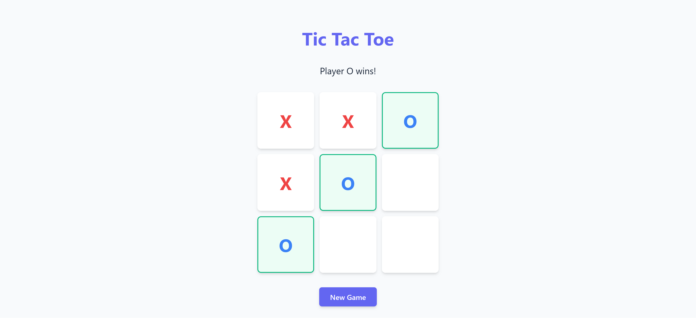
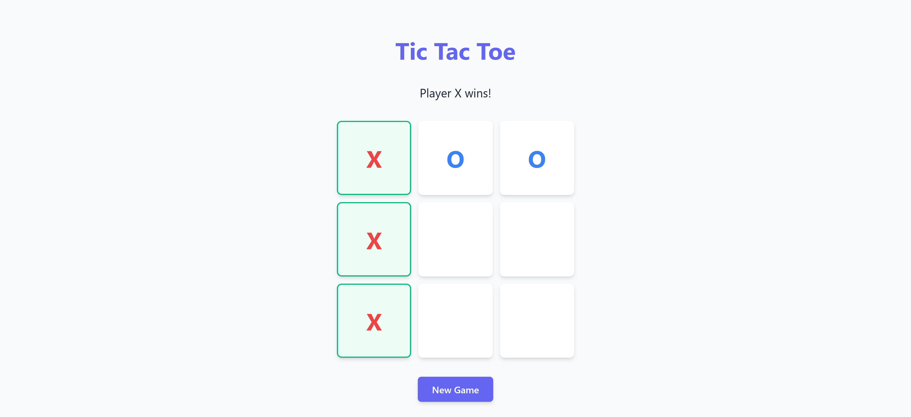

# 🎮 Tic Tac Toe 🟢❌

Welcome to the classic **Tic Tac Toe** game — built with HTML, CSS, and JavaScript! This simple yet entertaining two-player game lets you challenge a friend in your browser. First to get 3 in a row wins! 🏆

## 📸 Preview




## 🚀 How to Run

1. **Clone the repository:**

   ```bash
   git clone https://github.com/your-username/tic-tac-toe.git
   ```

2. **Navigate into the project folder:**

   ```bash
   cd tic-tac-toe
   ```

3. **Open `index.html` in your browser:**

   - Double-click the file
     **OR**
   - Use a live server extension in VS Code

## 🛠️ Tech Stack

- **HTML5**
- **CSS3**
- **JavaScript**

## ✅ Rules

- Players take turns placing **X** or **O** in empty cells.
- The first player to align **3 in a row** (horizontally, vertically, or diagonally) wins.
- If all cells are filled without a winner, it’s a **draw**.

## 🧪 Future Improvements

- 🎮 Single-player mode with AI
